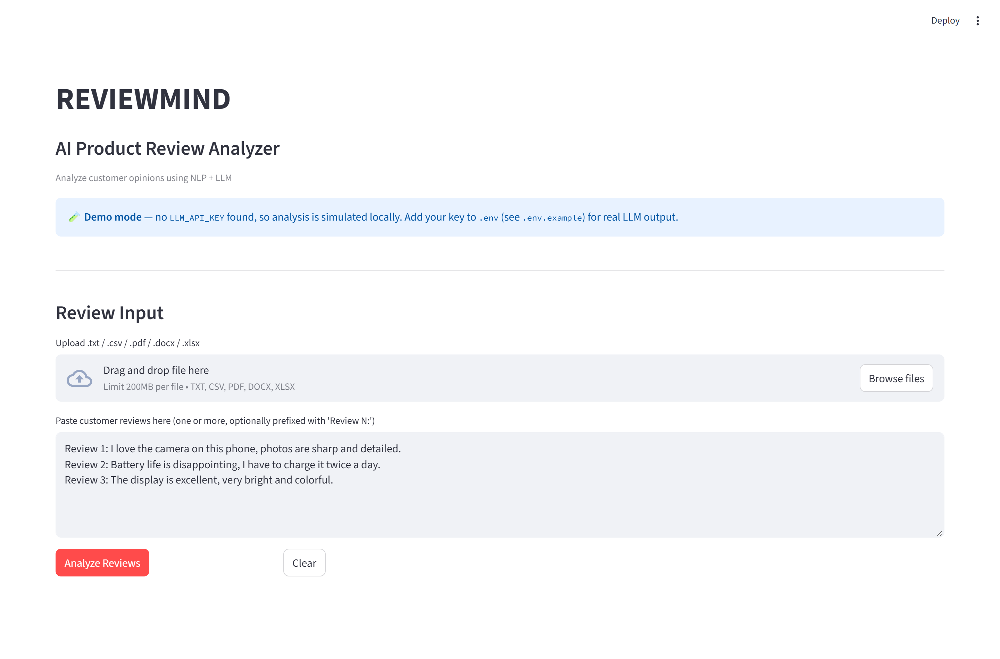
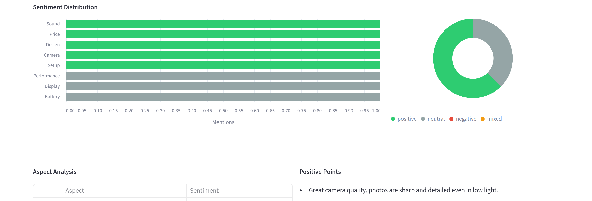
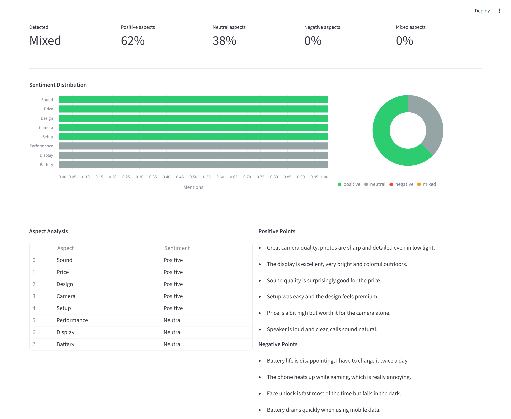
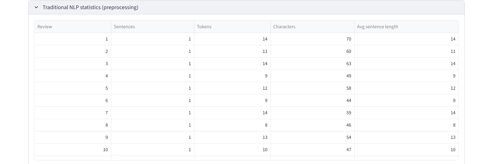
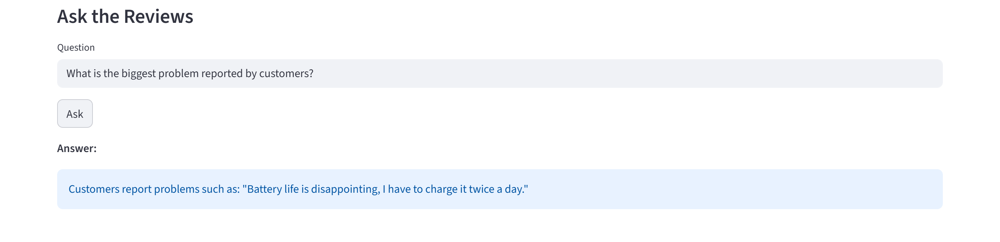

# ReviewMind

**AI Product Review Analyzer — traditional NLP preprocessing + LLM reasoning**

Turn unstructured customer feedback into a structured, validated dashboard.

[](requirements.txt)
[](requirements.txt)
[](LICENSE)
[](#6-testing)

---

## 1. What it does

You paste customer reviews (or upload a file). ReviewMind returns:

| Output | Explanation |
|---|---|
| **Overall sentiment** | positive / negative / neutral / mixed for the whole batch |
| **Aspect-based sentiment** | Camera, Battery, Display, Sound, Price … each judged separately |
| **Positive & negative points** | the actual sentences customers liked or disliked |
| **Common complaints** | issues that recur across reviews |
| **AI summary** | a 2–3 sentence executive summary |
| **NLP statistics** | per-review sentence / token / character counts and top keywords |
| **Grounded Q&A** | ask a question, get an answer built only from the reviews |

**No API key is required to try it.** Without a key the app runs in **demo mode** with a
local rule-based client that returns the same schema.

---

## 2. Demo (60 seconds, no setup)

```bash
git clone https://github.com/ApexYash11/ReviewMind.git
cd ReviewMind
pip install -r requirements.txt
streamlit run app/main.py
```

Paste a few reviews (or use `data/sample_reviews/sample_reviews.txt`) and click
**Analyze Reviews**.

### Screens

**1 — Input.** Upload a `.txt` / `.csv` / `.pdf` / `.docx` / `.xlsx` file or paste reviews.
Without an API key the app shows the demo-mode banner and simulates the LLM locally.



**2 — Sentiment overview.** Overall verdict plus the share of positive / neutral /
negative / mixed aspects (percentages always sum to 100%).


**3 — Sentiment distribution.** How often each aspect is mentioned, coloured by
sentiment, with the matching donut breakdown.



**4 — Aspect analysis and points.** Every detected aspect with its verdict, next to
the concrete positive and negative sentences pulled from the reviews.



**5 — Traditional NLP statistics.** Per-review preprocessing output and the top
keywords after stopword removal and lemmatization.



**6 — Grounded Q&A.** The answer cites a review verbatim, or states that the reviews
do not determine it — it never invents an answer.



> The screenshots above were captured from the app running in **demo mode**, so they
> need no API key. With a real key the same UI is filled by a live model.

---

## 3. The design idea

ReviewMind is **not** a chatbot wrapped around reviews. It is a small pipeline with a
strict division of labour: **cheap deterministic code does structure, the model does
judgement.**

| Traditional NLP (no model) | LLM (judgement only) |
|---|---|
| Text cleaning | Aspect extraction |
| Sentence segmentation | Aspect-based sentiment |
| Tokenization | Summarization |
| Stopword removal + lemmatization | Question answering |
| Review splitting | |
| Text statistics | |

Three rules follow from this, and they shape the whole codebase:

1. **Deterministic work stays out of the model.** Cleaning, splitting, tokenizing,
   normalizing and counting never call the API — they are fast, free and testable.
2. **The model only does what needs judgement.** Aspect extraction, sentiment,
   summarization and Q&A, always requested as JSON and never trusted raw.
3. **No silent failures, no hallucinated answers.** Every response is schema-validated
   before rendering, the UI shows friendly messages instead of stack traces, and Q&A is
   grounded in the supplied reviews.

### System design

```
┌──────────────┐   text / .txt .csv .pdf .docx .xlsx
│  Streamlit   │◄──────────────────────────────┐
│     UI       │                               │
└──────┬───────┘                        ┌──────┴───────┐
       │                                │ File parsers │
       ▼                                └──────────────┘
┌──────────────────┐
│ Input guardrails │  empty? too large? unsupported type?  → friendly error
└────────┬─────────┘
         ▼
┌──────────────────┐      deterministic, offline
│  NLP preprocessor│  clean → split reviews → split sentences
│  (NLTK + regex)  │  tokenize → stopwords → lemmatize → stats + keywords
└────────┬─────────┘
         ▼
┌──────────────────┐
│ Prompt builder   │  prompts/review_analysis.txt · prompts/review_qa.txt
└────────┬─────────┘
         ▼
┌──────────────────┐   timeout · exponential backoff · retries
│   LLM client     │   OpenAI-compatible (OpenRouter, OpenAI, Groq, Ollama)
└────────┬─────────┘
         ▼
┌──────────────────┐   JSON parse → schema check → dataclasses
│ Response         │   invalid ⇒ ValidationError, never a half-rendered dashboard
│ validator        │
└────────┬─────────┘
         ▼
┌──────────────────┐
│ Streamlit render │  metrics · charts · table · points · summary · Q&A
└──────────────────┘
```

**Why a validator sits between the model and the UI.** LLMs return text, not types.
A missing field, a wrong sentiment label or a stray sentence around the JSON would
otherwise crash the dashboard or, worse, render a wrong number as if it were real.
`app/review_analyzer.py` coerces the payload into `AnalysisResult`
(`app/models.py`) or raises `ValidationError`, which the UI renders as a message.

**Why the model is swappable.** `app/llm_client.py` talks to any OpenAI-compatible
endpoint, so the provider is a config value, not a code change:

| Provider | `LLM_BASE_URL` | Example `LLM_MODEL` |
|---|---|---|
| OpenRouter | `https://openrouter.ai/api/v1` | `openai/gpt-4o-mini` |
| OpenAI | `https://api.openai.com/v1` | `gpt-4o-mini` |
| Groq | `https://api.groq.com/openai/v1` | `llama-3.1-8b-instant` |
| Local (Ollama / LM Studio) | `http://localhost:11434/v1` | `llama3.1` |

**Why demo mode exists.** `app/mock_llm.py` implements the same interface as the real
client and returns the same schema, so the project can be demonstrated and tested with
no key and no network. It is a keyword-based simulation — good for UI and offline
demos, not a claim about analysis quality.

---

## 4. Setup with a real LLM

Requires Python 3.12+.

```bash
git clone https://github.com/ApexYash11/ReviewMind.git
cd ReviewMind
python -m venv .venv
.venv\Scripts\activate          # Windows
# source .venv/bin/activate     # macOS / Linux

pip install -r requirements.txt
copy .env.example .env          # Windows
# cp .env.example .env          # macOS / Linux
```

Set your key in `.env` and run the app:

```bash
# .env
LLM_API_KEY=your-key-here
LLM_MODEL=openai/gpt-4o-mini
LLM_BASE_URL=https://openrouter.ai/api/v1
```

```bash
streamlit run app/main.py
```

Defaults (timeouts, retries, temperature, token budget, input limit) live in
`config/config.yaml` and can be overridden by the matching `LLM_*` environment
variables. Free-tier models are slow — tens of seconds per analysis — and rate-limited;
that is the provider, not the app.

---

## 5. Presenting the project

1. Open the app, show the demo-mode banner (proves it runs with zero setup).
2. Load `data/sample_reviews/sample_reviews.txt`, click **Analyze Reviews**.
3. Walk the dashboard top to bottom: metrics → charts → aspect table → points → summary.
4. Expand **Traditional NLP statistics** to show the preprocessing layer.
5. Ask *"What is the biggest problem reported by customers?"* and point out the answer
   quotes a review.
6. Explain the flow: **Reviews → NLP → Prompt → LLM API → JSON → Validate → Streamlit**.

Full script: [`docs/TESTING.md`](docs/TESTING.md).

---

## 6. Testing

```bash
pytest -v        # 37 tests, no API key or network required
```

| Suite | Covers |
|---|---|
| `tests/test_nlp.py` | preprocessing, splitting, tokenization, normalization |
| `tests/test_analyzer.py` | response validation and orchestration |
| `tests/test_mock_llm.py` | demo-mode client schema conformance |
| `tests/test_uploads.py` | `.txt` / `.csv` / `.pdf` / `.docx` / `.xlsx` parsing |

**End-to-end against a live model:**

```bash
python -m tests.e2e_live     # 18 checks; needs LLM_API_KEY / LLM_MODEL / LLM_BASE_URL
```

It exercises NLP → prompt → API → JSON → validation → Q&A, and asserts that an
unanswerable question is *not* hallucinated. It costs API calls, so it is not collected
by `pytest`; the exit code is `0` when every check passes.

### Troubleshooting

| Symptom | Cause | Fix |
|---|---|---|
| `LLM returned no content: the token budget was consumed by reasoning` | Reasoning models spent all of `max_tokens` thinking | Raise `LLM_MAX_TOKENS` (6000+) or set `LLM_MAX_REASONING_TOKENS` |
| HTTP 403 *"only available on agentic harnesses"* | The chosen `:free` model is gated to coding agents | Pick another model in `.env` |
| HTTP 429 | Free-tier rate limit | Wait and retry; the client backs off automatically |
| Dashboard stays in demo mode | `LLM_API_KEY` missing or empty | Check `.env` and restart the app |

### Error handling

The UI shows friendly Streamlit messages — never stack traces — for empty input, empty
or unsupported files, oversized input, missing or invalid API key, timeouts, rate
limits, network errors, invalid JSON and missing response fields.

---

## 7. Repository layout

```
ReviewMind/
├── app/
│   ├── main.py            # Streamlit frontend, dashboard and charts
│   ├── llm_client.py      # Configurable OpenAI-compatible client (retries, JSON extraction)
│   ├── mock_llm.py        # Rule-based client used in demo mode
│   ├── nlp_processor.py   # Traditional NLP preprocessing
│   ├── review_analyzer.py # Orchestration + response validation
│   └── models.py          # Dataclasses, sentiment vocabulary, ValidationError
├── prompts/
│   ├── review_analysis.txt
│   └── review_qa.txt
├── config/config.yaml     # Provider, model, timeouts, input limits
├── tests/                 # Unit tests + e2e_live.py
├── data/sample_reviews/   # Sample corpora (.txt + .pdf)
├── docs/
│   ├── images/            # Screenshots used in this README
│   └── TESTING.md
├── .env.example
└── requirements.txt
```

---

## 8. Limitations

- Free-tier models are slow and rate-limited; quality depends on the provider.
- Demo-mode judgments are keyword-based and coarser than a real model's.
- The sample corpus is small and hand-written. No accuracy claim is made beyond
  "the pipeline returns validated, schema-conformant output".

---

## Credits

- **Developer** — [ApexYash11](https://github.com/ApexYash11)
- **Project guide** — project supervisor, reviewed on GitHub as a collaborator

## License

Apache-2.0 — see [LICENSE](LICENSE).